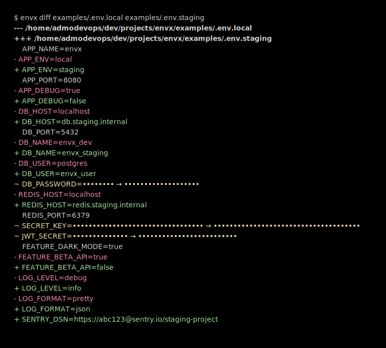
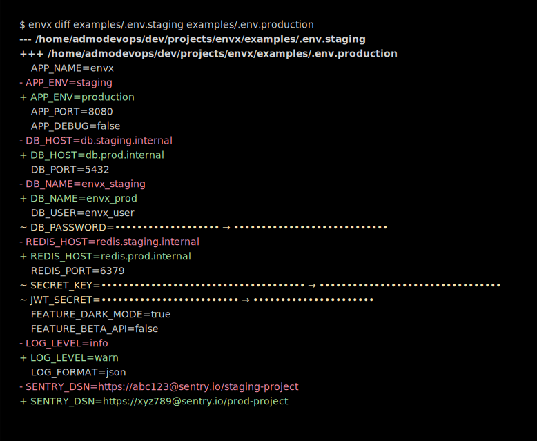
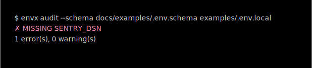
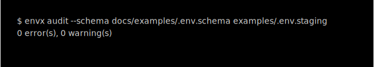

# envx

A fast, opinionated CLI for `.env` file management — diff, audit, encrypt.

## Install

```bash
cargo install --path .
```

## Commands

### `envx diff <file-a> <file-b>`

Semantic diff between two env files. Highlights added, removed, and changed
keys. Values for sensitive keys (`SECRET`, `KEY`, `TOKEN`, `PASSWORD`, etc.)
are always redacted.

Exits `0` if files are identical, `1` if differences are found.

**local vs staging:**



**staging vs production:**



---

### `envx audit --schema <schema-file> <env-file>`

Validates an env file against a schema. The schema is a plain-text file with
one required key per line (`#` comments allowed).

- `✗ MISSING` — required key absent → error
- `⚠ EMPTY` — required key present but blank → error
- `⚠ EXTRA` — key present but not declared in schema → warning

Exits `0` if no errors (warnings are OK), `1` if any required keys are missing
or empty.

**Failing audit** (`.env.local` is missing `SENTRY_DSN`):



**Passing audit** (`.env.staging` satisfies all required keys):



---

### `envx encrypt <file>` / `envx decrypt <file>`

Encrypts an env file with a passphrase using [age](https://age-encryption.org).
Prompts twice on encrypt (confirmation), once on decrypt.

```bash
# Produces .env.staging.age — original is kept
envx encrypt examples/.env.staging

# Restores to examples/.env.staging
envx decrypt examples/.env.staging.age
```

The original file is never deleted automatically.

---

## Example files

| File | Purpose |
|---|---|
| `examples/.env.local` | Local development defaults |
| `examples/.env.staging` | Staging environment |
| `examples/.env.production` | Production environment |
| `docs/examples/.env.schema` | Schema used in audit examples |

---

## Development

```bash
cargo build
cargo clippy -- -D warnings
cargo fmt
```
